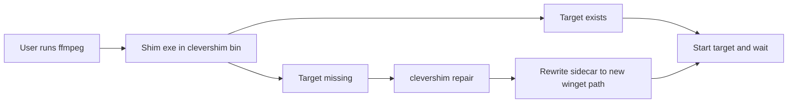

# How CleverShim works

## Why it exists

WinGet portable and zip packages land in versioned folders under:

- `%LOCALAPPDATA%\Microsoft\WinGet\Packages` (user)
- `%ProgramFiles%\WinGet\Packages` (machine)

The symlink WinGet would add under `WinGet\Links` often fails without Developer Mode, so commands disappear after install or move on upgrade. CleverShim puts a stable console shim on PATH instead.

The stub is original Rust. It does not copy Chocolatey’s shimgen.

## Two binaries

| Binary | Role |
| --- | --- |
| `clevershim` | Manager, installer, sync/repair/list/hooks |
| `clevershim-shim` | Stub copied to `bin\<command>.exe` |

## Sidecar

Each shim is a pair:

- `bin\<command>.exe` — the stub
- `bin\<command>.shim` — target path, package id, optional runner (`cmd.exe /c` for `.bat`/`.cmd`), working directory, child PATH prefix, manager path

Resolve order for a package:

1. WinGet Links (follow the symlink)
2. Package folders whose names start with `{PackageId}_`
3. Uninstall registry `InstallLocation`

`.ps1` targets are not shimmed.

## Repair rules

- At most one repair attempt per shim process
- Repair starts only when the recorded target file is missing
- A target that exists and then exits/crashes is returned as-is
- Repair refuses to write or launch the shim itself, another file in the clevershim `bin`, or `clevershim.exe`
- If another installed provider remains, repair retargets; if none remain, the shim is removed

## PATH policy

Directories are **appended**, never prepended. An earlier dedicated `ffmpeg.exe` still wins while it exists. Machine PATH sits before user PATH in the Windows merge order; user packages stay in the user bin so one user’s installs are not exposed to others.

## Shared builds and DLLs

The sidecar stores the real exe path and working directory (the exe’s folder). Windows loads DLLs from that folder, so shared FFmpeg builds work. A WinGet symlink in `Links` does not, because the loader looks beside the link. A child PATH prefix is added only when the manifest sets `ArchiveBinariesDependOnPath`.

## Hot desking

Each logged-on user gets their own bin, logon task, and overrides. Machine-scope packages stay in ProgramData on the system PATH. Machine-bin writes take a file lock.
